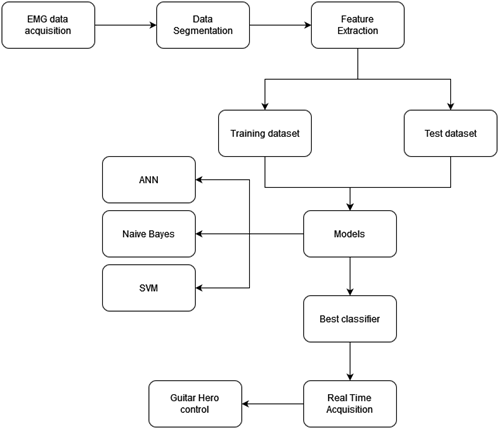
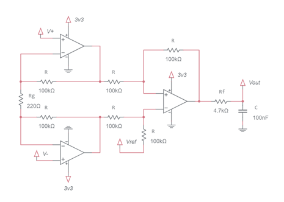
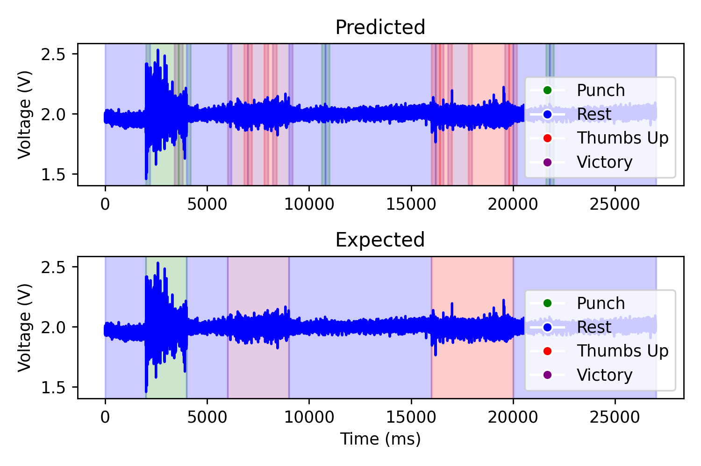

# Air Guitar with EMG

The project involves creating a system that enables users to control a Guitar Hero game using their muscle signals.

The system works by detecting and amplifying the electrical signals that muscles produce when they contract or relax.

The system has diverse applications in the area of human-computer interaction, particularly for individuals with physical disabilities or impairments that hinder their use of conventional input devices

## Project workflow

1. We chose a set of different gestures to be classified and collected a large sample of electric signals for each one;

1. We segmented the data we collected to extract relevant information about how each gesture is characterized;

1. We then separated it into segments of 200 ms;

1. We extracted and used time domain features to train the model;

1. Selection of the best model that was trained (ANN, Naïve Bayes).

1. Usage of the best classifier in real time acquisition.

1. Control of the game based on the prediction of the model

## Circuit

The hardware is simple, we created a circuit with an intrumentation amplifier and a low-pass filter:

## Results

The results were quite good for just one electrode and one example of classification can be seen bellow:

Bit still the prediction system still has a lot of room for improvement:
- Exploring other classification techniques.
- Increasing the number of features extracted from the signal
- Increasing the training dataset.
- Increasing the number of channels
